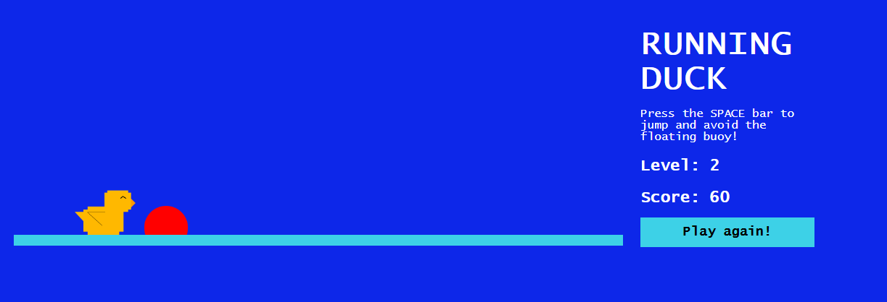
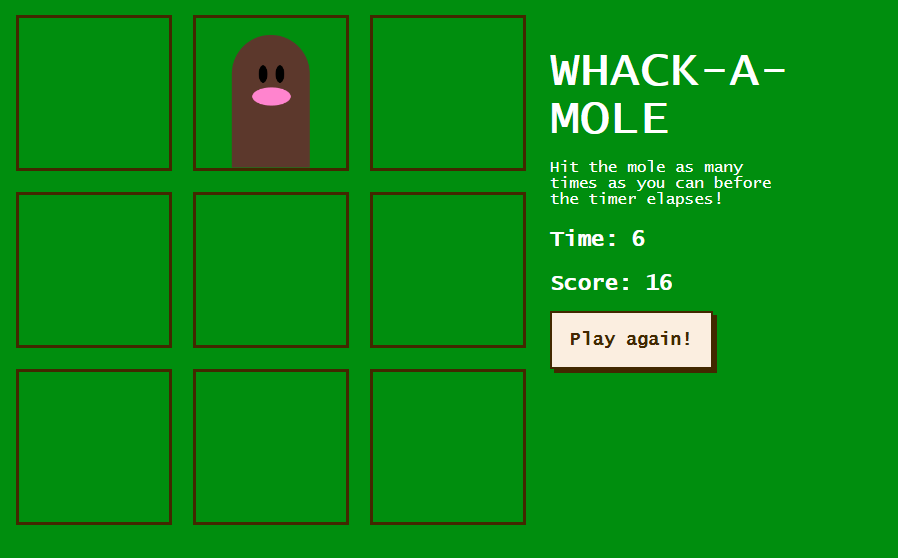

<h1>Arcade - HTML/CSS/Javascript mini-projects</h1> 

<h3>Running Duck</h3>

    First arcade game: <i>infinite runner</i>. 
    What happens when you're a duck trying to avoid a buoy that's floating right in your direction? You <b>jump</b>! 

    The game area is structured as a grid: each grid cell is a div. 
    While the duck will stay floating in the same point, the buoy will move one cell at a time. 
    You can avoid crashing into the obstacle by tapping the space bar and making the duck jump - thanks to the CSS transform property. 
    The progress will be easily tracked with:
    <ul>
        <li>the score: increased by ten per each obstacled that's been avoided</li> 
        <li>the level and the speed of the buoy: both increased by one each time the score will reach a value that's a multiple of 50</li>
     </ul>

<h3>Whack-A-Mole</h3>

    Here's a revival of the popular <i>whack-a-mole</i>. 
    There's one easy rule: hit the mole as many times as you can until the time is up! 

    The game area is a grid and each cell is a div, where the mole will appear. 
    You can hit the mole by tapping on it with the cursor, just be fast: the timer is running and the mole is speeding up as well, increasing the difficulty of the game second by second. 
    When a mole gets hit, your score goes up by one - and the mole will be <em>clearly</em> hurt.

 
